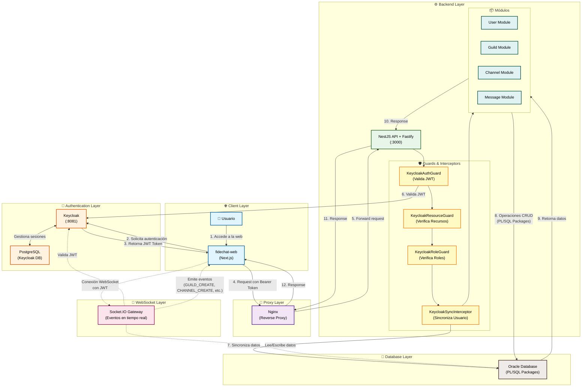

# Fidechat Backend

A modern real-time chat application backend built with NestJS, Oracle Database, and WebSocket integration. This project features guild-based chat rooms, user authentication via Keycloak, and a robust database architecture with Oracle PL/SQL packages.


## Index

1. [🚀 Features](#-features)
2. [🔄 Request Flow Diagram](#-request-flow-diagram)
3. [🛠️ Tech Stack](#️-tech-stack)
4. [📋 Prerequisites](#-prerequisites)
5. [⚡ Quick Start](#-quick-start)
   - [1. Clone the Repository](#1-clone-the-repository)
   - [2. Install Dependencies](#2-install-dependencies)
   - [3. Environment Configuration](#3-environment-configuration)
   - [4. Start the Services](#4-start-the-services)
   - [5. Initialize the Database](#5-initialize-the-database)
   - [6. Run the Application](#6-run-the-application)
6. [🗂️ Project Structure](#️-project-structure)
7. [🌐 API Endpoints](#-api-endpoints)
   - [Postman Collection](#postman-collection)
   - [Authentication](#authentication)
   - [Users](#users)
   - [Guilds](#guilds)
   - [Channels](#channels)
   - [WebSocket Events](#websocket-events)
8. [🗄️ Database Schema](#️-database-schema)
9. [📜 Available Scripts](#-available-scripts)
10. [🐳 Docker Configuration](#-docker-configuration)
    - [Starting Services](#starting-services)
11. [🔐 Authentication Setup (Keycloak)](#-authentication-setup-keycloak)
12. [🛠️ Troubleshooting](#️-troubleshooting)
    - [Common Issues](#common-issues)

## 🚀 Features

- **Real-time Communication**: WebSocket integration for instant messaging
- **Guild-based Architecture**: Discord-like guild and channel management
- **Authentication**: Keycloak integration for secure user authentication
- **Oracle Database**: Enterprise-grade database with PL/SQL packages and procedures
- **RESTful API**: Complete CRUD operations for users, guilds, and channels
- **Type Safety**: Full TypeScript implementation with strict typing
- **Validation**: Input validation using class-validator
- **Docker Support**: Complete containerization with Docker Compose
- **Kubernetes Support**: Minikube setup for local Kubernetes cluster deployment

## 🔄 Request Flow Diagram

This diagram illustrates how a request flows through the Fidechat application, from initial user authentication to data processing and real-time updates.



### 📝 Flujo Detallado

#### 1️⃣ Autenticación (Steps 1-3)
- El usuario accede a la aplicación web (fidechat-web con Next.js)
- La aplicación redirige al usuario a Keycloak para autenticación
- Keycloak valida las credenciales y almacena la sesión en PostgreSQL
- Keycloak retorna un JWT Token al cliente

#### 2️⃣ Request API (Steps 4-5)
- El cliente envía una petición HTTP con el Bearer Token en el header Authorization
- Nginx actúa como reverse proxy y redirige la petición a la API NestJS

#### 3️⃣ Validación & Seguridad (Steps 6-7)
- **KeycloakAuthGuard**: Valida el JWT Token contra Keycloak
- **KeycloakResourceGuard**: Verifica los recursos a los que el usuario tiene acceso
- **KeycloakRoleGuard**: Verifica los roles del usuario
- **KeycloakSyncInterceptor**: Sincroniza los datos del usuario con Oracle DB

#### 4️⃣ Procesamiento (Steps 8-12)
- Los módulos (User, Guild, Channel, Message) procesan la solicitud
- Se ejecutan operaciones CRUD usando PL/SQL Packages en Oracle
- Los datos se retornan a través de la cadena: Modules → NestJS → Nginx → Cliente

#### 5️⃣ WebSocket (Comunicación en Tiempo Real)
- Los clientes establecen una conexión WebSocket con el Gateway
- El Gateway valida el JWT Token con Keycloak
- Se emiten eventos en tiempo real (GUILD_CREATE, CHANNEL_CREATE, etc.)
- Los clientes conectados reciben actualizaciones instantáneas

## 🛠️ Tech Stack

- **Backend Framework**: NestJS with Fastify
- **Database**: Oracle 18c Express Edition
- **Authentication**: Keycloak with PostgreSQL
- **Language**: TypeScript
- **WebSockets**: Socket.IO
- **Validation**: class-validator, class-transformer
- **Containerization**: Docker & Docker Compose (+ Kubernetes setup)
- **Package Manager**: pnpm

## 📋 Prerequisites

Before running this project, make sure you have the following installed:

- **Node.js** >= 20.X.X
- **npm** >= 10.X.X (or **pnpm** recommended)
- **Docker** and **Docker Compose**
- **Git**

## ⚡ Quick Start

### 1. Clone the Repository

```bash
git clone <repository-url>
cd Fidechat-backend
```

### 2. Install Dependencies

```bash
# Using pnpm (recommended)
pnpm install

# Or using npm
npm install
```

### 3. Environment Configuration

Create a `.env` file in the root directory with the following variables:

```env
# Application
NODE_ENV=development
API_PORT=3000

# Oracle Database
ORACLE_HOST=localhost
ORACLE_PORT=1521
ORACLE_USER=system
ORACLE_PWD=your_oracle_password
ORACLE_SERVICE_NAME=XEPDB1

# PostgreSQL (for Keycloak)
PG_USER=keycloak
PG_PASSWORD=your_postgres_password
PG_NAME=keycloak
DB_PORT=5432

# Keycloak
KEYCLOAK_ADMIN=admin
KEYCLOAK_ADMIN_PASSWORD=your_keycloak_admin_password
KC_PORT=8081
KEYCLOAK_URL=http://localhost:8081
KEYCLOAK_REALM=your_realm
KEYCLOAK_CLIENT_ID=your_client_id
KEYCLOAK_CLIENT_SECRET=your_client_secret

# Keycloak Database
KC_DB_USERNAME=keycloak
KC_DB_PASSWORD=your_postgres_password
KC_DB_URL=jdbc:postgresql://postgres:5432/keycloak
```

### 4. Start the Services

```bash
# Start all services (Oracle, PostgreSQL, Keycloak)
docker-compose -f local-docker-compose.yaml up -d

# Wait for services to be ready (especially Oracle DB initialization)
# This may take a few minutes on first run
```

### 5. Initialize the Database

The Oracle database will be automatically initialized with the schema and packages from `/sql/init.sql` when the container starts for the first time.

### 6. Run the Application

```bash
# Development mode with hot reload
pnpm run dev

# Or using npm
npm run dev

# Production mode
pnpm run start:prod
```

The application will be available at:
- **API**: http://localhost:3000
- **Keycloak Admin**: http://localhost:8081 (admin/your_keycloak_admin_password)

## 🗂️ Project Structure

```
.
├── scripts                   # Helper scripts for project setup and maintenance
├── sql                       # Database scripts
│   ├── init.sql              # Main initialization script
│   ├── pkg_*.sql             # PL/SQL packages
│   └── triggers.sql
├── src                       # Application source code
│   ├── common                # Shared utilities and services
│   │   ├── logger            # Custom logging implementation
│   │   │   ├── constants     # Logger constants
│   │   │   ├── interfaces    # Logger interfaces
│   │   │   └── utils         # Logger utilities
│   │   └── utils             # Environment validation
│   ├── config                # Configuration files
│   ├── database              # Database connection and types
│   │   └── oracle            # Oracle-specific implementations
│   │       ├── query-builder # Query builder for Oracle
│   │       └── types         # Oracle-specific types
│   ├── modules               # Feature modules
│   │   ├── auth              # Authentication (Keycloak)
│   │   │   └── keycloak
│   │   ├── channel
│   │   ├── dashboard    
│   │   ├── gateway
│   │   ├── guild
│   │   └── user              # User management
│   │       └── currentUser   # Current user utilities (like sync data client <- backend)
│   └── utils                 # Utility functions
└── types                     # Global TypeScript types
```

## 🌐 API Endpoints

### Postman Collection

todo

### Authentication
- Authentication is handled via Keycloak JWT tokens
- Include `Authorization: Bearer <token>` header in requests

### Users

- `GET /user/sync` - Get current user sync data
- User CRUD operations are handled via PL/SQL packages

### Guilds

- `POST /guild` - Create a new guild
- `GET /guild/:id` - Get guild by ID
- `PUT /guild/:id` - Update guild
- `DELETE /guild/:id` - Delete guild

### Channels

- `POST /channel` - Create a new channel
- `GET /channel/:id` - Get channel by ID
- `PUT /channel/:id` - Update channel
- `DELETE /channel/:id` - Delete channel

### WebSocket Events

- `GUILD_CREATE` - Guild creation events
- `CHANNEL_CREATE` - Channel creation events
- Real-time updates for all guild and channel operations

## =� Database Schema

The application uses Oracle Database with the following main entities:

- **APP_USER**: User information and profiles
- **GUILD**: Chat server/guild data
- **CHANNEL**: Text channels within guilds
- **GUILD_USERS**: Many-to-many relationship for guild membership

Key PL/SQL packages:
- `PKG_USER`: User management operations
- `PKG_GUILD`: Guild management operations
- `pkg_sync_data`: Data synchronization functions

## 📜 Available Scripts

```bash
# Development
pnpm run dev              # Start development server with hot reload
pnpm run start:debug      # Start with debug mode

# Building
pnpm run build            # Build the application
pnpm run start:prod       # Start production server

# Code Quality
pnpm run lint             # Run ESLint
pnpm run format           # Format code with Prettier
```

## 🐳 Docker Configuration

The project includes a complete Docker setup:

- **Oracle 18c Express**: Main application database
- **PostgreSQL**: Keycloak database
- **Keycloak**: Authentication and authorization server

### Starting Services

```bash
# Start all services
docker-compose -f local-docker-compose.yaml up -d

# View logs
docker-compose -f local-docker-compose.yaml logs -f
```

## 🔐 Authentication Setup (Keycloak)

1. Access Keycloak Admin Console at http://localhost:8081
2. Login with admin credentials from your `.env` file
3. Create a new realm or configure the existing one
4. Create a client for the application
5. Update the `.env` file with the client credentials

## 🛠️ Troubleshooting

### Common Issues

1. **Oracle Connection Issues**
   - Ensure Oracle container is fully started (may take 2-3 minutes)
   - Check Oracle credentials in `.env` file
   - Verify ORACLE_SERVICE_NAME is correct

2. **Keycloak Authentication**
   - Verify Keycloak is accessible at the configured URL
   - Check client configuration in Keycloak admin
   - Ensure JWT tokens are properly formatted

3. **WebSocket Connection Issues**
   - Check CORS configuration
   - Pray to Jesus if all else fails

## 📝 To-Do List

- [ ] Fix socket connection TTL: Currently, using Keycloak, there is no mechanism to disconnect clients with expired Keycloak tokens. Implement a solution to refresh tokens or disconnect clients when their tokens expire.
- [ ] Implement missing CRUD operations in sockets.